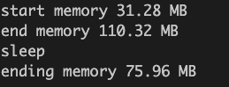
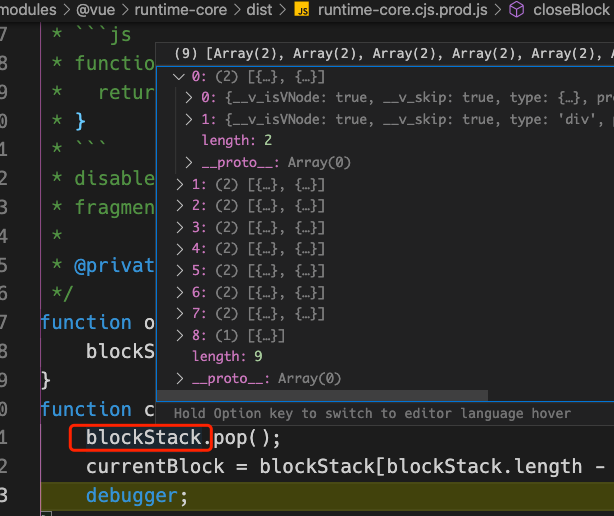
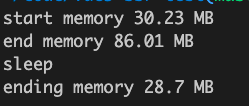
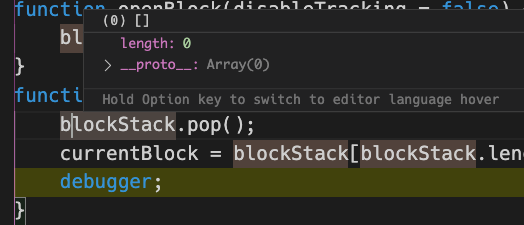

# Vue SSR memory leak when error occur

#### how to reproduce ?

__env__: Node 10.22.0

__source__: in src fold

__bundle code__: `bundle_error.js`, `bundle_success.js`

__test code__: `test_success.js`, `test_error.js`

First of all, install dependencies: ```npm install```

#### What is actually happening?
run error test: ```node test_error```, 

you can see the result is like this:



one snapshot of `blockStack` is like this :



The problem is : `blockStack` grows every time it is executed, `blockStack` is not freed when something error occur.

#### What is expected?

run success test: ```node test_success```,
you can see the result is like this:


one snapshot of `blockStack` is like this:



we can see the length of `blockStack` is always zero when function `closeBlock` called, and the memory behaving normally.

#### Question
Is this is a bug ? If so, Maybe we need an method like `clearBlockStack` so that we can free the `blockStack` in time when some error occur. If not, we would be very grateful if you tell me how to solve this problem. At last, Thanks for reading this issue. :)